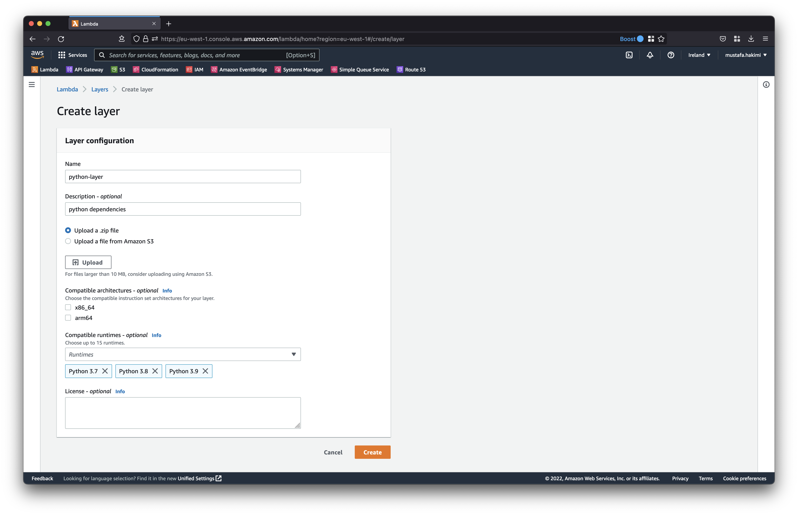
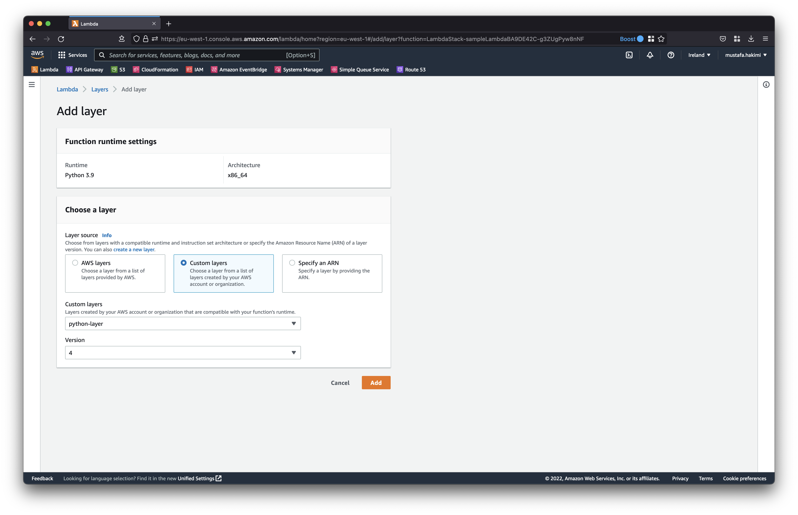

# AWS Lambda Layers using CDK

* [Lambda Layers](#lambda-layers)
* [Manually Deploy Layer](#manually-deploy-layer)
* [Sources](#sources)

### Lambda Layers
Directory structures: 
```shell
# For Python layers
/python/lib/python3.6/site-packages
/python/lib/python3.8/site-packages

# For Nodejs layers
/nodejs
```
**Limitations**
* Maximum 5 layers
* Size limits: 50MB direct upload and 250MB total


### Manually Deploy Layer
1. Create a python layer 
```shell
# Go to python layer location
cd layers/python/lib/python3.9/site-packages

# Install request as layer
pip install requests -t .

# Go back to /layer
cd layers

# Create a zip of layers
zip -r python-layer.zip python
```
2. Create the layer 



3. Attach the layer to the Lambda function 



4. Invoke the Lambda function


### Troubleshooting

* [Lambda image launch error exec format](https://stackoverflow.com/questions/68247643/aws-lambda-alpine-python-container-shows-image-launch-error-exec-format-error)

### Sources

* [Working with Lambda layers and extensions in container images](https://aws.amazon.com/blogs/compute/working-with-lambda-layers-and-extensions-in-container-images/)
* [AWS Creating and sharing Lambda layers](https://docs.aws.amazon.com/lambda/latest/dg/configuration-layers.html)
* [Using Lambda Layers in AWS CDK - TypeScript](https://bobbyhadz.com/blog/aws-cdk-lambda-layers)